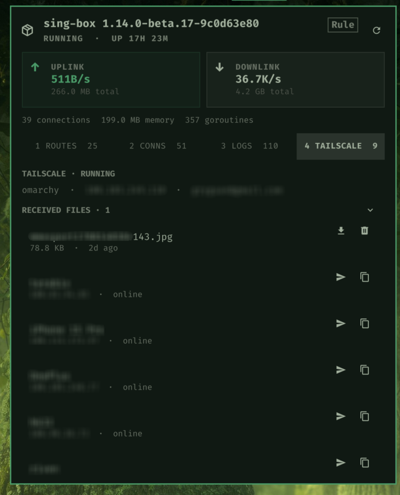

<div align="center">

# Sinbar

**Your sing-box dashboard, right in the Omarchy bar.**

Live traffic · Routes · Connections · Logs · Tailscale & Taildrop

A keyboard-first plugin for the **Omarchy Quattro** shell.

[Install](#install) · [Configuration](#configuration) · [Controls](#controls) · [Development](#development)



<sub>QML + Go · Linux amd64 / arm64 · MIT licensed</sub>

</div>

## At a glance

| Area | What you can do |
| --- | --- |
| **Bar & status** | Follow download speed in a fixed-width widget; see upload/download totals, uptime, memory, and service status in the panel. |
| **Routes** | Browse outbound groups, switch nodes, test latency, and change Clash mode. |
| **Connections** | Find connections by domain, address, process, or route; close one or all. |
| **Logs** | Follow messages in sing-box's own colors, filter by keyword, and clear logs. |
| **Tailscale** | Browse peers, copy IPs, select or clear an Exit Node, and open the authentication link when needed. |
| **Taildrop** | Send files, drop them onto the bar, and preview, save, or discard received files. |

Navigate with `j` / `k`, filter with `/`, and press `?` for help. A fixed footer shows
shortcuts for the current tab and focus, with unavailable actions dimmed.

Sinbar talks to [sing-box](https://sing-box.sagernet.org) through its `StartedService`
gRPC API. Tailscale controls use that same API; a separate `tailscaled` service or
`tailscale` CLI is not required.

## Install

### Requirements

- Omarchy Quattro shell and a Nerd Font.
- sing-box with the `StartedService` gRPC API enabled.
- **For source builds only:** Go 1.25.5 or newer.
- **Optional:** your own terminal TUI command for the right-click shortcut.

<details>
<summary><strong>External commands and desktop services</strong></summary>

| Used for | Dependencies |
| --- | --- |
| Plugin management and rendering | Omarchy Quattro, Quickshell, Qt Quick/Controls, and the shell's `qs.Ui` / `qs.Commons` imports |
| Repository installation | Git, through `omarchy plugin add` |
| Bridge bootstrap | POSIX `sh`, `curl`, `sha256sum`, `sed`, and standard Unix file utilities |
| Local build and validation | Go, Make, `qmllint`, Omarchy CLI, and `jq` |
| Copying peer IPs | `wl-copy` (wl-clipboard) |
| Choosing files to send | `omarchy-file-select`, session D-Bus, and a working desktop file-chooser portal; the Omarchy helper uses Python 3 and PyGObject/Gio |
| Opening received files | `xdg-open` and an associated desktop application |
| Tailscale authentication | `omarchy-launch-browser` and a configured browser |
| Optional terminal TUI | `omarchy launch terminal`, Bash, and your configured command |

Sinbar connects to an existing sing-box service; it does not install, configure, or start
that service. Enable its StartedService API before use. Tailscale features additionally
require a configured sing-box Tailscale endpoint and authentication to your tailnet.

</details>

### Add the plugin

```sh
omarchy plugin add https://github.com/d3vw/sinbar.git --enable
```

The plugin prepares its bridge on first launch. No separate build command is needed
when a matching prebuilt binary is available.

<details>
<summary><strong>How the bridge is installed and updated</strong></summary>

`omarchy plugin add` clones the repository; it does not run a build step.
On first launch, `scripts/ensure-bridge.sh`:

1. Downloads the Linux `amd64` or `arm64` bridge from the GitHub Release matching `manifest.json`.
2. Verifies its SHA-256 checksum before installing it.
3. Falls back to building from source if the download is unavailable and Go is installed.

The bridge is cached in `bin/sinbar-bridge`, with its version recorded in `bin/.version`.
When a plugin update changes the manifest version, the next launch prepares the matching
bridge. If an update cannot be downloaded or built, an existing binary is kept with a warning.

</details>

### From a local checkout

```sh
make install-local
```

This tests, validates, and builds the plugin, installs it under
`~/.config/omarchy/plugins/io.github.d3vw.sinbar/`, and enables the widget.
Run it again after source edits to sync the installed copy.

<details>
<summary><strong>Uninstall</strong></summary>

```sh
omarchy plugin remove io.github.d3vw.sinbar
```

From a local checkout, `make uninstall-local` runs the same command.

</details>

## Configuration

Sinbar reads `~/.config/sinbar/config.toml`. If your API uses `127.0.0.1:9999`
without a secret, the defaults work without creating a file.

```toml
host = "127.0.0.1"
port = 9999
secret = "your-api-secret"
tls = false
interval_ms = 1000
tailscale_endpoint = "Tailscale"
```

Match these values to your sing-box API settings; omit `secret` if authentication is not configured.

| Setting | Purpose |
| --- | --- |
| `host` / `port` | sing-box `StartedService` API address |
| `secret` | API authentication secret, if configured |
| `tls` | Enable TLS for the gRPC connection |
| `interval_ms` | Status polling interval in milliseconds; default `1000` |
| `tailscale_endpoint` | Tailscale endpoint tag; default `Tailscale` |

For a configuration containing a secret:

```sh
chmod 600 ~/.config/sinbar/config.toml
```

### Bar settings

The plugin ID is `io.github.d3vw.sinbar`. Its default bar section is `right`.
To place it there explicitly:

```sh
omarchy bar move io.github.d3vw.sinbar --section right
```

| Setting | Default | Purpose |
| --- | --- | --- |
| **Config path** | `~/.config/sinbar/config.toml` | Use a different connection configuration |
| **Show live speeds in bar** | `On` | Show or hide the bar's download readout |
| **TUI command** | Empty | Command to open in a terminal on right click; empty disables it |

## Controls

### Everyday navigation

| Key | Action |
| --- | --- |
| `1` / `2` / `3` / `4` | Routes / Connections / Logs / Tailscale |
| `h` / `l` | Previous / next tab |
| `j` / `k` or `↓` / `↑` | Move selection in Routes, Connections, or Tailscale |
| `/` | Filter the current section |
| `?` | Toggle the full shortcut reference |
| `m` | Cycle Clash mode |
| `r` | Reconnect the API bridge |
| `t` | Open the configured terminal TUI |
| `Esc` | Dismiss help first, otherwise close the panel |

### Within each tab

| Tab | Key | Action |
| --- | --- | --- |
| **Routes** | `Tab` / `Shift+Tab` | Switch focus between Group and Node |
| | `Enter` on Group | Focus that group's nodes |
| | `Enter` on Node | Select the outbound |
| | `u` | Test the focused node's latency |
| **Connections** | `x` / `X`, `d`, or `Enter` | Close the selected visible connection |
| | `D` | Close **all** connections, including filtered-out rows |
| **Logs** | `c` | Clear logs |
| **Tailscale** | `s` | Choose files to send to the selected peer |
| | `c` | Copy the selected peer's first Tailscale IP |

Routes starts with Group focused. A `▸` heading and row highlight show where `j` / `k`
will move. Browsing groups previews their nodes; selecting an outbound requires Enter
in Node or clicking a node. Outside Routes, Tab switches shell panels.

Tailscale highlights the current peer on hover, click, or keyboard navigation and keeps
the highlight when the pointer leaves. Sending requires an online peer that can receive
files. Opening the file chooser closes the panel first to release keyboard focus.

### Search

Press `/` to filter live, `Enter` to confirm and return to navigation, or `Esc` while
editing to clear the filter. Press `/` again to edit an existing keyword. Action shortcuts
are inactive while typing.

Search is case-insensitive. Each section remembers its own keyword, including separate
filters for Group and Node. Keyboard actions follow the visible selection.

| Section | Searchable fields |
| --- | --- |
| **Group** | Group name |
| **Node** | Node name and type |
| **Connections** | Domain, source/destination address, process path, network type, inbound/outbound name |
| **Logs** | Message text |
| **Tailscale** | Peer name, DNS name, IPs, OS, and received filenames |

### Mouse & files

| Input | Action |
| --- | --- |
| Left click the bar widget | Open or close the panel |
| Middle click | Restart the API bridge |
| Right click | Open the configured terminal TUI |
| Drop files onto the bar widget | Open Tailscale to choose a recipient |
| Click a received file | Preview it with the desktop's default application |
| Received-file action buttons | Save to `~/Downloads` or discard |

## Development

Use the [Omarchy development guide](https://plugins.omarchy.org/develop.html) as the
authoring reference. Keep installed edits in the user plugin directory, never in
`$OMARCHY_PATH/shell/plugins/`.

Sinbar declares one `bar-widget`, with `entryPoints.barWidget` pointing to `Panel.qml`.
That file uses the shell's `Panel` base for its bar button and nested popup lifecycle;
`Service.qml` is an internal helper, not a separately registered service plugin.

The bar and panel stay in QML; all gRPC communication runs through the Go JSON-lines bridge.
High-frequency connection and log streams are active only while the panel is open.

| File | Responsibility |
| --- | --- |
| `Panel.qml` | Bar widget, panel, and keyboard navigation |
| `Service.qml` | Bridge processes, streams, and actions |
| `Model.js` | Display formatting helpers |
| `manifest.json` | Plugin metadata and settings schema |
| `scripts/ensure-bridge.sh` | Bridge download and source-build fallback |
| `cmd/sinbar-bridge/` | Go JSON-lines bridge |
| `client/` | StartedService API client |
| `daemon/` | Generated protobuf bindings |

```sh
make check          # Test, validate QML/plugin, and build
make install-local  # Also install and enable the user plugin
```

<details>
<summary><strong>Individual checks and troubleshooting</strong></summary>

```sh
go test ./...
omarchy plugin validate "$PWD"
qmllint -I "$OMARCHY_PATH/shell" Panel.qml Service.qml
```

Confirm discovery and enablement:

```sh
omarchy-shell shell rescanPlugins
omarchy plugin list --json | jq '.[] | select(.id == "io.github.d3vw.sinbar")'
```

Exercise the shell lifecycle:

```sh
omarchy-shell shell summon io.github.d3vw.sinbar '{}'
omarchy-shell shell hide io.github.d3vw.sinbar
```

Before release, manually check clicks, Escape, shell open/close, disable/re-enable,
restart, and removal. These are verification steps, not a claim that every scenario
is covered by automated tests.

If an installed QML change does not appear, restart the shell to replace existing instances:

```sh
omarchy restart shell
```

Inspect shell errors:

```sh
qs log -p "$OMARCHY_PATH/shell" --tail 100
```

Connection errors appear in the bar tooltip; action errors appear in the panel.
Reconnecting briefly stops the bridge as part of normal operation.

</details>

<details>
<summary><strong>Publishing a release</strong></summary>

Bump `manifest.json` and push a matching `vX.Y.Z` tag. The release workflow intentionally
checks that the tag matches the manifest version, then produces Linux `amd64` and `arm64`
bridges with `.sha256` files and build-provenance attestations.

Local installation replaces the bridge atomically and writes `bin/.version` so the
bootstrap script recognizes the locally built binary.

</details>

## Security & privacy

### Permissions and local data

Installation and normal operation use your user permissions; Sinbar has no sudo/polkit
step and installs no system service or package-manager hooks. It runs inside the existing
shell and starts bridge/helper processes, not a second Quickshell instance.

| Location | Use |
| --- | --- |
| `~/.config/sinbar/config.toml` | Read connection settings and the API secret |
| `~/.config/omarchy/plugins/io.github.d3vw.sinbar/` | Installed plugin, cached bridge, and version stamp |
| Files chosen for sending | Read and send through sing-box Taildrop |
| `~/Downloads/` | Save received files |
| `$XDG_CACHE_HOME/sinbar/taildrop/` (default `~/.cache/sinbar/taildrop/`) | Stage received files for preview |

Removing the plugin does not clean up the separate Sinbar configuration, preview cache,
or saved downloads. Discarding a received file acts on sing-box's pending inbox.

### Network and execution

Omarchy plugins run unsandboxed inside the shell process. The Go bridge reads the API
secret directly from TOML; the secret is not passed through QML state or process arguments.

The bootstrap script verifies downloaded binaries against their release SHA-256 files.
The release workflow also publishes build-provenance attestations, but the bootstrap
script does not verify those attestations. Source builds may download Go dependencies.
Runtime communication uses the configured sing-box API; file previews and the optional
TUI command launch desktop applications.

## License

[MIT](LICENSE)
